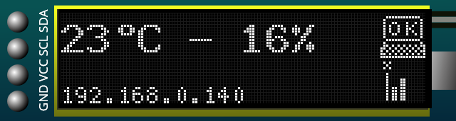
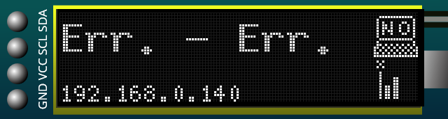

# Simple Temperature and Humidity Reporter

This project combines several components in order to have an automatic reporting of temperature and humidity based on the (rather low-precision) DHT11.
The main board is a D1-Mini (ESP-8266 based) and screen is a basic 128x32 OLED.

Here is the main idea:

## Principle

The D1-Mini allows to interface with all 3 other devices:

 * The DHT-11 sensor does only need a pin, we selected D5;
 * The OLED screen is communicating with I2C, the board has a hardware I2C interface with pings D1&D2;
 * The pushbutton will go to ground so we connect it to the pullup input of D3

We didn't use D4 as it's plugged in the blue LED, we can use the D4 pin as a LED indicator in case the I2C screen does not work.

All peripherals are connected in 5V.

## Requirements

### Hardware

The current solution is based on:

 * ESP8266 - Any version should work.
 * DHT11 - The DHT22 version should work too.
 * SSD1306 128x32 OLED display - Any version supported by u8g2 should work.
 * A button - this is purely optional.

### Software

For the embedded part, you need [Arduino](https://www.arduino.cc/) with the following:

 * Git version of [ESP8266 core](https://github.com/esp8266/Arduino)
 * DHT sensor library
 * U8G2 display library

## Compiling

You have first to define the following constants in secrets.example.h and rename it to secret.h

| Name  | Value |
| ---- | ----- |
| `WIFI_NAME`  | Name of your Wifi Access Point |
| `WIFI_PASS`           | Password of your wifi Access Point |
| `API_HOSTNAME`        | Hostname of the server part |
| `API_ENDPOINT`        | Path of the endpoint - default: `/data` |
| `API_PORT`            | Port of the server - default: `443` |
| `API_AUTH_TOKEN`      | Auth token for the server - default: `70ch4n63454p`|

**Important** Make a note of `API_AUTH_TOKEN` and compute its sha1 and put in the file `web/data/secrets.php`.

Then you can open the main `.ino` file and compile it. You will need latest git version of [ESP8266 Aruidno core](https://github.com/esp8266/Arduino).

## Installing

### Embedded part

Upload the code to the ESP8266 and you're good to go. You should have a picture like this:

If there is an error reading the temperature or humidity, you will have a picture like this:

### Server part

Upload the `web/` folder into a server that supports PHP. `json_decode` is needed for communication (included with latest versions of php).

## Running

Simply wait for the data to be uploaded. By default, a new point (average of last 10 last measures) will be uploaded every 120 minutes.