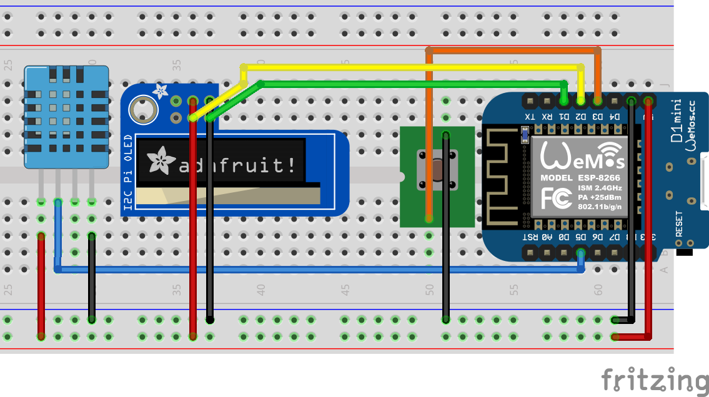

Simple Temperaterature and Humidity Reporter
============================================

This project combines several components in order to have an automatic reporting of temperature and humidity based on the (rather low-precision) DHT11.
The main board is a D1-Mini (ESP-8266 based) and screen is a basic 128x32 OLED.

Here is the main idea:

